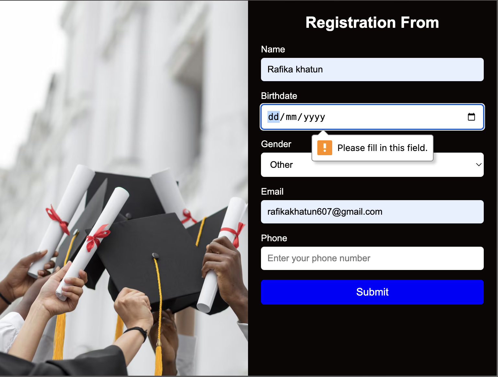

# Responsive Registration Form

This is a simple and elegant responsive registration form built using HTML and CSS. The layout features a split-screen design with an image on the left and a form on the right. It is fully responsive and adjusts gracefully across desktop, tablet, and mobile screens.

## Features

- Clean and modern UI design
- Responsive layout using media queries
- Input fields for name, birthdate, gender, email, and phone
- Stylish button with hover effect
- Uses `flexbox` for layout management
- Custom gradient background

## Technologies Used

- HTML5
- CSS3 (Flexbox + Media Queries)

## Folder Structure       
You can check the design preview below:

